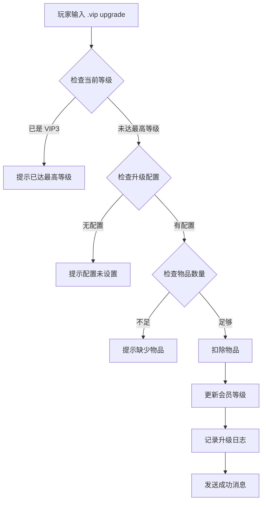

# 会员升级功能使用说明

## 功能概述

会员升级功能允许玩家通过消耗指定的游戏物品来自行提升会员等级，无需 GM 手动操作。管理员可以通过 GM 命令灵活配置每个等级所需的物品种类和数量。

## 玩家使用说明

### 查看升级信息

玩家可以使用以下命令查看下一级升级所需的信息：

```
.vip upgrade
```

**输出示例：**
```
=== VIP Upgrade Info ===
Current Level: VIP0
Next Level: VIP1
Required: 10 x [金币] (Item ID: 1)
You have: 15 x [金币]
Status: Ready to upgrade
Usage: .vip upgrade <target_level>
```

### 执行升级

当玩家拥有足够的升级物品时，可以执行升级：

```
.vip upgrade [目标等级]
```

**示例：**
```
.vip upgrade 1    # 升级到 VIP1
.vip upgrade 2    # 升级到 VIP2
.vip upgrade 3    # 升级到 VIP3
```

**成功输出：**
```
=== VIP Upgrade Successful! ===
Previous Level: VIP0
New Level: VIP1
Consumed: 10 x Item ID 1
```

**失败输出（物品不足）：**
```
Not enough items for upgrade!
Required: 50 x [金币]
You have: 20 x [金币]
Missing: 30 x [金币]
```

### 升级限制

1. 只能升级到比当前等级高的等级
2. 不能降级（如从 VIP2 降到 VIP1）
3. 已经是 VIP3 的玩家无法继续升级
4. 必须拥有足够的升级物品

## GM 配置说明

### 设置升级物品

管理员可以使用以下命令配置升级所需物品：

```
.vip upgrade set [目标等级] [物品 ID] [数量]
```

**示例：**
```
# 设置 VIP1 升级需要 100 个金币 (物品 ID: 1)
.vip upgrade set 1 1 100

# 设置 VIP2 升级需要 500 个银币 (物品 ID: 2)
.vip upgrade set 2 2 500

# 设置 VIP3 升级需要 10 个珍稀宝石 (物品 ID: 12345)
.vip upgrade set 3 12345 10
```

**输出示例：**
```
Upgrade item configuration updated!
Target Level: VIP1
Required: 100 x [金币] (Item ID: 1)
Note: Changes take effect immediately. Use .vip reload to refresh cache.
```

### 查看升级历史

管理员可以查看玩家的升级历史记录：

```
.vip log [玩家名]
```

**输出示例：**
```
=== VIP Upgrade History for PlayerName ===
[2026-04-18 15:30:00] VIP0 -> VIP1 | Consumed: 10 x ItemID:1
[2026-04-18 16:45:00] VIP1 -> VIP2 | Consumed: 50 x ItemID:1
[2026-04-18 18:20:00] VIP2 -> VIP3 | Consumed: 200 x ItemID:1
```

### 重载配置

修改升级物品配置后，使用以下命令重载缓存：

```
.vip reload
```

## 物品 ID 查询

如果不知道物品 ID，可以使用以下命令查询：

```
.lookup item [物品名称]
```

**示例：**
```
.lookup item 金币
```

**输出：**
```
Item: [金币] (ID: 1)
Item: [金币袋] (ID: 2070)
...
```

## 推荐配置方案

以下是几种推荐的升级物品配置方案：

### 方案 1：使用游戏货币

```conf
VIP1: 100 x 金币 (Item ID: 1)
VIP2: 500 x 金币 (Item ID: 1)
VIP3: 2000 x 金币 (Item ID: 1)
```

适合经济系统稳定的服务器，玩家可以通过游戏时间积累。

### 方案 2：使用特殊道具

```conf
VIP1: 10 x 会员徽章碎片 (Item ID: 50001)
VIP2: 50 x 会员徽章碎片 (Item ID: 50001)
VIP3: 200 x 会员徽章碎片 (Item ID: 50001)
```

适合通过活动或副本掉落的特殊道具。

### 方案 3：混合配置

```conf
VIP1: 100 x 金币 (Item ID: 1)
VIP2: 500 x 金币 (Item ID: 1) + 10 x 荣誉徽章 (Item ID: 2070)
VIP3: 2000 x 金币 (Item ID: 1) + 50 x 荣誉徽章 (Item ID: 2070) + 5 x 稀有宝石 (Item ID: 12345)
```

适合多阶段升级，增加升级挑战性。

## 数据库直接配置

也可以通过数据库直接配置升级物品：

```sql
-- 设置 VIP1 升级物品
INSERT INTO vip_upgrade_items (target_tier, item_id, quantity) 
VALUES (1, 1, 100)
ON DUPLICATE KEY UPDATE item_id = 1, quantity = 100;

-- 设置 VIP2 升级物品
INSERT INTO vip_upgrade_items (target_tier, item_id, quantity) 
VALUES (2, 1, 500)
ON DUPLICATE KEY UPDATE item_id = 500, quantity = 500;

-- 设置 VIP3 升级物品
INSERT INTO vip_upgrade_items (target_tier, item_id, quantity) 
VALUES (3, 1, 2000)
ON DUPLICATE KEY UPDATE item_id = 2000, quantity = 2000;
```

配置后执行 `.vip reload` 使配置生效。

## 升级日志查询

管理员可以通过数据库查询所有升级历史：

```sql
-- 查询最近的升级记录
SELECT 
    l.upgrade_time,
    FROM_UNIXTIME(l.upgrade_time) as time_str,
    l.account_id,
    p.name as player_name,
    l.old_tier,
    l.new_tier,
    l.item_id,
    i.name as item_name,
    l.quantity
FROM vip_upgrade_log l
LEFT JOIN characters p ON l.account_id = p.account
LEFT JOIN item_template i ON l.item_id = i.entry
ORDER BY l.upgrade_time DESC
LIMIT 100;
```

## 常见问题

### Q1: 玩家升级后物品没有被扣除？

检查 `vip_upgrade_items` 表中是否配置了正确的物品 ID 和数量，然后执行 `.vip reload`。

### Q2: 升级失败但没有错误提示？

查看服务器日志文件中的会员系统日志：
```
LOG_INFO("member", ...)
```

### Q3: 如何禁用玩家自助升级？

在 `vip.conf` 中设置：
```conf
MemberSystem.Enable = 0
```

或者不配置任何升级物品，玩家就无法升级。

### Q4: 升级物品配置后多久生效？

配置立即写入数据库，但需要执行 `.vip reload` 命令刷新内存缓存后才能生效。

### Q5: 玩家能否通过交易获取升级物品？

可以。升级物品是普通游戏物品，玩家可以通过任何合法方式获取，包括：
- 打怪掉落
- 任务奖励
- 玩家交易
- 拍卖行购买
- GM 发放

### Q6: 如何防止玩家刷升级物品？

建议采取以下措施：
1. 使用绑定的升级物品（使用 `Bind: 1` 的物品模板）
2. 设置合理的升级物品种类（如副本掉落、活动奖励等）
3. 监控升级日志，发现异常及时处理

## 技术实现

### 升级流程



### 数据结构

**vip_upgrade_items 表：**
| 字段 | 类型 | 说明 |
|------|------|------|
| target_tier | tinyint | 目标等级 (1-3) |
| item_id | int | 物品 ID |
| quantity | int | 所需数量 |

**vip_upgrade_log 表：**
| 字段 | 类型 | 说明 |
|------|------|------|
| id | bigint | 自增 ID |
| account_id | int | 账号 ID |
| old_tier | tinyint | 原等级 |
| new_tier | tinyint | 新等级 |
| item_id | int | 消耗物品 ID |
| quantity | int | 消耗数量 |
| upgrade_time | bigint | 升级时间戳 |

## 安全性和合规性

1. **物品扣除原子性**：物品扣除和等级更新在同一事务中执行
2. **日志记录**：所有升级操作都会记录到数据库
3. **权限控制**：`.vip upgrade set` 需要管理员权限
4. **等级验证**：升级前会验证当前等级和目标等级
5. **物品验证**：升级前会验证物品 ID 和数量的有效性

## 扩展建议

1. **限时会员**：可以扩展支持限时升级（如 30 天 VIP）
2. **批量升级**：支持一键升级到最高等级
3. **升级奖励**：升级时发送奖励邮件
4. **升级通知**：全服广播玩家升级消息
5. **升级任务**：完成特定任务才能升级
