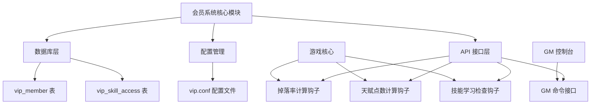

# 会员系统设计文档

Feature Name: member-system
Updated: 2026-04-18

## 描述

为 AzerothCore 魔兽世界 3.3.5a 服务端实现完整的会员 (VIP) 系统，包括会员等级管理、掉落率加成、天赋点数加成和技能学习权限控制。系统采用模块化设计，通过钩子函数集成到现有游戏逻辑中。

## 架构



### 架构说明

1. **核心模块**: `MemberSystem` 单例类，管理全局会员状态和配置
2. **数据库层**: 负责会员数据的持久化存储和查询
3. **配置管理**: 从 `vip.conf` 加载会员权益参数
4. **API 接口层**: 提供钩子函数供游戏核心调用
5. **游戏核心集成**: 通过现有的钩子机制集成到掉落、天赋、技能系统

## 组件和接口

### 1. MemberSystem 核心类

**位置**: `src/server/scripts/Custom/MemberSystem/MemberSystem.h`

```cpp
class MemberSystem {
public:
    static MemberSystem* instance();
    
    // 初始化
    bool LoadConfig();
    bool LoadFromDB();
    
    // 会员数据访问
    uint32 GetMemberTier(uint32 accountId) const;
    float GetDropRateBonus(uint32 accountId) const;
    uint8 GetTalentPointBonus(uint32 accountId, uint8 level) const;
    bool CanLearnSpell(uint32 accountId, uint32 spellId) const;
    
    // 数据修改
    void SetMemberTier(uint32 accountId, uint32 tier);
    void SaveMemberToDB(uint32 accountId, uint32 tier, uint32 expireTime);
    
    // 配置访问
    float GetTierDropRateBonus(uint32 tier) const;
    uint8 GetTierTalentBonus(uint32 tier) const;
    
private:
    MemberSystem();
    ~MemberSystem();
    
    // 配置数据
    bool m_enabled;
    std::array<float, 4> m_dropRateBonuses;      // 各等级掉落率加成
    std::array<uint8, 4> m_talentPointBonuses;   // 各等级天赋点加成
    
    // 缓存数据
    UNORDERED_MAP<uint32, MemberData> m_memberCache;
};
```

### 2. MemberData 数据结构

```cpp
struct MemberData {
    uint32 accountId;
    uint32 tier;           // 0-3
    uint32 expireTime;     // Unix timestamp
    uint64 createTime;
    uint64 updateTime;
};
```

### 3. 数据库表结构

**文件**: `data/sql/base/db_world/vip_member.sql`

```sql
-- 会员信息表
DROP TABLE IF EXISTS `vip_member`;
CREATE TABLE `vip_member` (
  `account_id` int(10) unsigned NOT NULL COMMENT '账号 ID',
  `tier` tinyint(3) unsigned NOT NULL DEFAULT '0' COMMENT '会员等级 (0-3)',
  `expire_time` int(10) unsigned NOT NULL DEFAULT '0' COMMENT '过期时间 (Unix 时间戳)',
  `create_time` bigint(20) unsigned NOT NULL DEFAULT '0' COMMENT '创建时间',
  `update_time` bigint(20) unsigned NOT NULL DEFAULT '0' COMMENT '更新时间',
  PRIMARY KEY (`account_id`),
  KEY `idx_expire_time` (`expire_time`)
) ENGINE=InnoDB DEFAULT CHARSET=utf8mb4 COMMENT='会员信息表';

-- 技能会员权限表
DROP TABLE IF EXISTS `vip_skill_access`;
CREATE TABLE `vip_skill_access` (
  `spell_id` int(10) unsigned NOT NULL COMMENT '技能 ID',
  `min_tier` tinyint(3) unsigned NOT NULL DEFAULT '0' COMMENT '最低会员等级要求',
  PRIMARY KEY (`spell_id`),
  KEY `idx_min_tier` (`min_tier`)
) ENGINE=InnoDB DEFAULT CHARSET=utf8mb4 COMMENT='技能会员权限表';
```

### 4. 钩子函数集成

#### 4.1 掉落率计算钩子

**位置**: `src/server/scripts/Custom/MemberSystem/hooks/DropRateHook.cpp`

```cpp
// 集成到 Creature 的掉落计算逻辑
void OnCalculateLootDropRate(Player* player, float& dropRate) {
    if (!sMemberSystem->IsEnabled())
        return;
    
    uint32 accountId = player->GetSession()->GetAccountId();
    float bonus = sMemberSystem->GetDropRateBonus(accountId);
    dropRate = dropRate * (1.0f + bonus);
}
```

#### 4.2 天赋点数计算钩子

**位置**: `src/server/scripts/Custom/MemberSystem/hooks/TalentPointHook.cpp`

```cpp
// 集成到玩家升级时的天赋点数计算
void OnCalculateTalentPointsForLevel(Player* player, uint8& talentPoints) {
    if (!sMemberSystem->IsEnabled())
        return;
    
    uint32 accountId = player->GetSession()->GetAccountId();
    uint8 level = player->GetLevel();
    uint8 bonus = sMemberSystem->GetTalentPointBonus(accountId, level);
    talentPoints += bonus;
}
```

#### 4.3 技能学习检查钩子

**位置**: `src/server/scripts/Custom/MemberSystem/hooks/SpellLearnHook.cpp`

```cpp
// 集成到技能学习检查逻辑
bool CanLearnSpell(Player* player, uint32 spellId) {
    if (!sMemberSystem->IsEnabled())
        return true;
    
    uint32 accountId = player->GetSession()->GetAccountId();
    return sMemberSystem->CanLearnSpell(accountId, spellId);
}
```

### 5. GM 命令接口

**位置**: `src/server/scripts/Commands/cs_vip.cpp`

```cpp
class vip_commandscript : public CommandScript
{
public:
    vip_commandscript();
    
    // 命令定义
    std::vector<ChatCommand> GetCommands() const override;
    
    // 命令处理函数
    static bool HandleVipSetCommand(ChatHandler* handler, const char* args);
    static bool HandleVipInfoCommand(ChatHandler* handler, const char* args);
    static bool HandleVipReloadCommand(ChatHandler* handler, const char* args);
};
```

### 6. 配置文件

**位置**: `etc/vip.conf.dist`

```conf
# 会员系统配置

# 是否启用会员系统
MemberSystem.Enable = 1

# 各等级掉落率加成 (百分比，0.2 = 20%)
# VIP0, VIP1, VIP2, VIP3
MemberSystem.DropRateBonus.0 = 0
MemberSystem.DropRateBonus.1 = 0.2
MemberSystem.DropRateBonus.2 = 0.5
MemberSystem.DropRateBonus.3 = 1.0

# 各等级天赋点数加成 (每 10 级奖励点数)
# VIP0, VIP1, VIP2, VIP3
MemberSystem.TalentPointBonus.0 = 0
MemberSystem.TalentPointBonus.1 = 1
MemberSystem.TalentPointBonus.2 = 2
MemberSystem.TalentPointBonus.3 = 5
```

## 数据模型

### 会员等级枚举

```cpp
enum MemberTier : uint32
{
    MEMBER_TIER_NONE    = 0,  // 普通会员 (VIP0)
    MEMBER_TIER_SENIOR  = 1,  // 高级会员 (VIP1)
    MEMBER_TIER_SUPER   = 2,  // 超级会员 (VIP2)
    MEMBER_TIER_ULTIMATE = 3  // 至尊会员 (VIP3)
};
```

### 默认权益配置

| 会员等级 | 掉落率加成 | 天赋点加成 (每 10 级) | 技能学习权限 |
|---------|-----------|-------------------|-------------|
| VIP0    | 0%        | 0 点              | 普通技能     |
| VIP1    | 20%       | 1 点              | VIP1 及以下   |
| VIP2    | 50%       | 2 点              | VIP2 及以下   |
| VIP3    | 100%      | 5 点              | 所有技能     |

## 正确性属性

### 不变量

1. 会员等级必须为 0-3 之间的整数
2. 掉落率加成必须 >= 0
3. 天赋点数加成必须 >= 0
4. 账号 ID 必须为正整数
5. 过期时间必须为有效的 Unix 时间戳

### 约束条件

1. 会员数据查询必须先检查缓存，缓存未命中时才查询数据库
2. 掉落率计算必须在基础掉落率上进行加成
3. 天赋点数计算必须在玩家升级时触发
4. 技能学习检查必须在学习动作发生前进行

## 错误处理

### 错误场景及处理策略

1. **数据库连接失败**
   - 记录错误日志
   - 使用默认 VIP0 等级
   - 不影响游戏核心功能

2. **配置文件缺失或格式错误**
   - 使用内置默认配置
   - 记录警告日志

3. **会员数据不存在**
   - 自动创建默认 VIP0 记录
   - 返回默认权益

4. **技能 ID 无效**
   - 记录警告日志
   - 拒绝学习该技能

5. **玩家离线时会员等级变更**
   - 数据保存到数据库
   - 玩家下次登录时加载最新数据

### 日志记录

```cpp
// 错误日志示例
LOG_ERROR("member", "Failed to load member data for account {}: database error", accountId);
LOG_WARN("member", "Member config file not found, using default values");
LOG_INFO("member", "Member system initialized successfully, {} members loaded", count);
```

## 测试策略

### 单元测试

1. **MemberSystem 单元测试**
   - 测试配置加载
   - 测试掉落率加成计算
   - 测试天赋点数计算
   - 测试技能学习权限检查

2. **数据库操作测试**
   - 测试会员数据读取
   - 测试会员数据写入
   - 测试缓存机制

### 集成测试

1. **掉落率集成测试**
   - 创建不同等级的会员账号
   - 击杀测试生物并记录掉落
   - 验证掉落率是否符合预期

2. **天赋点数集成测试**
   - 创建不同等级的会员角色
   - 升级并检查天赋点数
   - 验证天赋点数加成是否正确

3. **技能学习集成测试**
   - 为不同技能设置会员等级要求
   - 使用不同等级的会员尝试学习
   - 验证权限控制是否生效

4. **GM 命令测试**
   - 测试 `.vip set` 设置会员等级
   - 测试 `.vip info` 查询会员信息
   - 测试 `.vip reload` 重载配置

### 性能测试

1. **缓存命中率测试**: 验证 99% 以上的查询命中缓存
2. **并发测试**: 验证 1000+ 玩家同时在线时的性能
3. **数据库负载测试**: 验证高频读写时的数据库性能

## 实现计划

### 阶段 1: 基础框架 (2 天)
- [ ] 创建项目目录结构
- [ ] 实现 MemberSystem 核心类
- [ ] 实现配置文件读取
- [ ] 创建数据库表和 SQL 脚本

### 阶段 2: 核心功能 (3 天)
- [ ] 实现掉落率加成钩子
- [ ] 实现天赋点数加成钩子
- [ ] 实现技能学习权限检查
- [ ] 实现 GM 命令

### 阶段 3: 集成测试 (2 天)
- [ ] 编写单元测试
- [ ] 编写集成测试
- [ ] 性能测试和优化

### 阶段 4: 部署上线 (1 天)
- [ ] 编写部署文档
- [ ] 数据库迁移
- [ ] 配置文件部署
- [ ] 生产环境测试

## 依赖项

1. **AzerothCore 核心**: 需要完整的构建环境
2. **MySQL 数据库**: 需要 acore_world 数据库访问权限
3. **CMake 构建系统**: 需要能够编译和链接到核心

## 参考文献

[^1]: (AzerothCore 模块开发指南) - https://www.azerothcore.org/wiki/Module-development
[^2]: (Hook 系统文档) - https://www.azerothcore.org/wiki/Hooks
[^3]: (CommandScript 编写指南) - https://www.azerothcore.org/wiki/commands-script
[^4]: (MemberSystem.h#L1) - 会员系统核心类定义
[^5]: (vip_member.sql#L1) - 会员数据表结构
